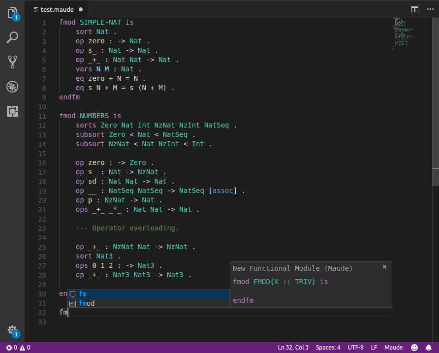

# vscode-maude README

Visual Studio Code extension for Maude, includes snippets and syntax highlighting.

Based on the `.tmBundle` by [mkhl](https://github.com/mkhl/maude.tmbundle). 

## Features

Includes language declarations and textmate tokenizers, providing highlighting for the Maude language.

Also includes some snippets adapted to better work on Visual Studio Code. Removing regular expression substitution on placeholder text, see [issue #34683](https://github.com/Microsoft/vscode/issues/34683)

## Release Notes

### 1.0.0

Initial release